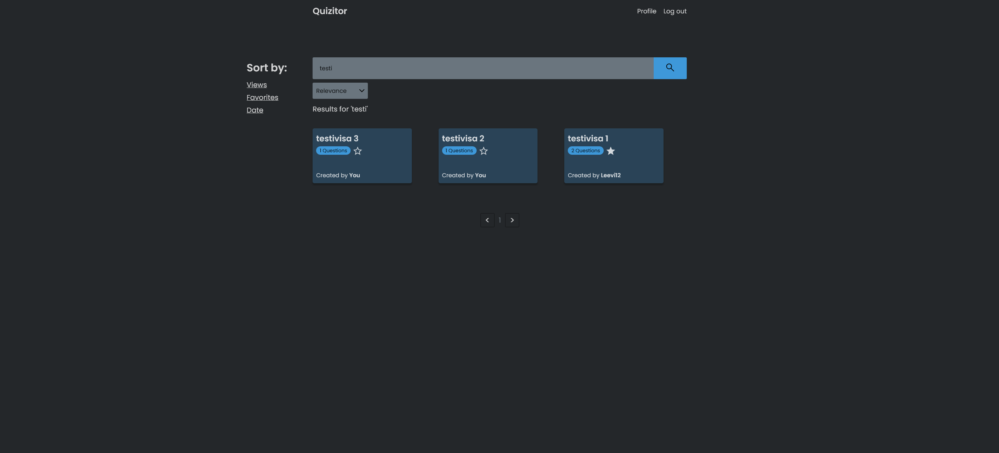

# Quizitor

> Create, browse and do quizzes

## Stack

- Next.js
- tRPC
- PostgreSQL with Prisma ORM

## Features

- [x] Authentication
- [x] View public quizzes
- [x] Track quiz views
- [x] Create quizzes
  - [x] Make Public/private
  - [x] Make favorite
  - [x] Edit
  - [x] Delete
- [x] Save quiz score
- [x] Search quizzes
  - [x] Sorting
- [ ] ...

## Database diagram

## Images

### Home

### Search quizzes

### Create quiz

### Start quiz

### Quiz question

### Quiz score

